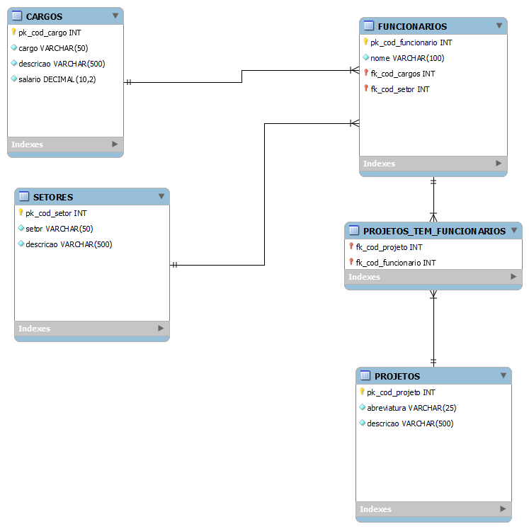

###Enunciado:
A empresa de desenvolvimento de software em que você trabalha precisa desenvolver um software para o setor de recursos humanos de uma empresa contratante. Você, como Projetista de Dados do projeto, foi encarregado de construir o modelo relacional do sistema. Em uma reunião com o cliente, o cenário foi levantado e, depois, registrado por meio do seguinte texto em uma ata:

"A empresa organiza o seu trabalho em projetos que possuem um número identificador como código, uma abreviatura do projeto e um texto descritivo. Por exemplo, um projeto pode ser de código 2134, com abreviatura de "TOPAZIO" e com breve descrição de "Construção do condomínio predial Topázio". Em cada projeto, são alocados os empregados que possuem um código e um nome; se um projeto possui seu conjunto de empregados, um empregado pode atuar junto a vários projetos. Além disso, o sistema tem um cadastro de cargos e um cadastro dos setores da empresa. O registro de um cargo possui um código, uma descrição e o valor do salário, e o de um setor possui um código e uma descrição. Cada empregado deve estar associado ao seu cargo e alocado ao seu setor".

Diante desse cenário, responda às questões a seguir.

Construa o modelo relacional que representa o cenário exposto, contemplando tabelas, campos, chaves primárias e chaves estrangeiras no modelo.
Apresente o comando de DDL (Data Definition Language) para a criação da tabela de CARGOS, contemplando os campos, seus tipos de dados, a obrigatoriedade e a chave primária.

**Segue a resposta do exercício feito com o MySQL Workbench com 5 arquivos.**

- 1 ReadMe.md com as explicações da lógica que me levaram a resolver a atividade.
- 1 SQL com o DDL para a criação do banco completo.
- 1 SQL com o DDL para a criação somente da tabela CARGOS como pedido no enunciado.
- 1 PNG com o modelo relacional.
- 1 arquivo mwb do MySQL Workbench com a criação do Modelo.


###Minha resposta:
Criei o modelo relacional abaixo:




Este modelo foi elaborado com o seguinte raciocino lógico:

Elaborei as tabelas pensando nos relacionamentos. Cada tabela tinha uma chave primária com o código então, seria cod_cargo para o código dos cargos, cod_funcionarios para o código dos funcionários e assim por diante, sempre seguindo o padrão cod_ seguido do nome da tabela em singular.

Cada funcionário possui um cargo e um setor, e somente um de cada. Porém, cada cargo e cada setor podem estar relacionados a muitos funcionários, sendo que as relações entre a tabela FUNCIONARIOS e a tabela CARGOS, assim como a relação entre a tabela FUNCIONARIOS e a tabela SETORES serão então de 1:n, de um para muitos. Então, na tabela FUNCIONARIOS, além dos atributos pedidos código e nome, também adicionei as chaves estrangeiras fk_cod_setor e fk_cod_cargo.

Já cada projeto pode estar relacionado a mais de um funcionário e mais de um funcionário pode estar relacionado a mais de um projeto. Com uma relação n:m, de muitos para muitos. Para tanto, criei uma tabela extra PROJETOS_TEM_FUNCIONARIOS com dois atributos que são duas chaves estrangeiras relacionando o código do projeto com o código do funcionário, fk_cod_projeto e fk_cod_projeto.

Este foi meu pensamento inicial, mas acho que foi aqui que perdi pontos pois depois pensei que podem haver funcionários sem projetos então não seria n:m e sim 0,n. Ms como não houve retorno do tutor sobre o que errei é suposição minha.

Todas as chaves primárias e estrangeiras são do tipo INT Unsigned, visto que não faz sentido o código ser negativo e desse modo vou ter o dobro de possibilidades de código. As chaves primárias de códigos também são de autoincremento para que no cadastro não seja necessária a precaução com a criação do código, ele sempre será gerado automaticamente sendo o próximo de cada entidade.
Para o salário na tabela CARGOS decidi usar um DECIMAL(10,2) imaginando que o salário do cargo mais alto não passaria de 99.999.999,99.

Para os atributos cargo e setor das tabelas CARGOS e SETORES, respectivamente, decidi usar o tipo VARCHAR(50) visto que os nomes dos cargos e setores não deveriam ser muito longos. Já para o nome na tabela FUNCIONARIOS usei o VARCHAR(100), já que alguns nomes são bem compridos e é interessante não se abreviar o nome do funcionário.

Nas tabelas SETORES, CARGOS e PROJETOS, no atributo descrição, ainda usei VARCHAR mas com 500 caracteres, pensando que no exemplo dado a descrição tem 75 caracteres mas gostaria de dar a possibilidade de se detalhar um pouco mais sem se estender demais, então pensei em 500 caracteres que são aproximadamente 75 palavras. Por ser um breve texto, um tipo como TEXT seria desperdício neste atributo.

Já na tabela PROJETOS, a abreviatura usa VARCHAR(25), pois a abreviatura não deveria ser longa, mas vemos pelo exemplo TOPAZIO que ela também não será necessariamente curta.
Todos os atributos são NOT NULL, não nulo visto que todos eles são obrigatórios.

Abaixo, segue o comando DDL para a criação da tabela CARGOS como pedido no enunciado:
```

CREATE TABLE IF NOT EXISTS `construtora`.`CARGOS` (
  `pk_cod_cargo` INT UNSIGNED NOT NULL AUTO_INCREMENT,
  `cargo` VARCHAR(50) NOT NULL,
  `descricao` VARCHAR(500) NOT NULL,
  `salario` DECIMAL(10,2) NOT NULL,
  PRIMARY KEY (`pk_cod_cargo`));

```

 